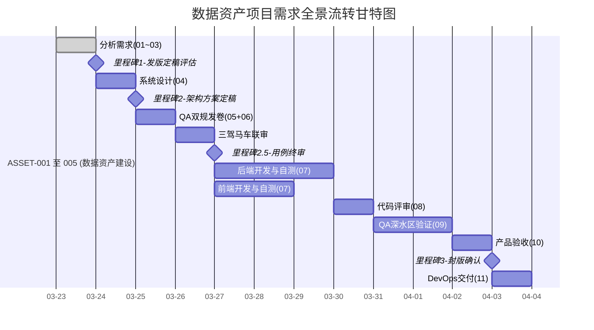

# 需求进度跟踪

通过以下甘特图维护数据资产功能模块各个需求（User Story / Epic）的全生命周期进度状态。所有阶段必须与最新工作流 `1-feature-implementation.md` 的序列化协作步骤严格一一对应。

```mermaid
gantt
    title 数据资产项目需求全景流转甘特图
    dateFormat  YYYY-MM-DD
    axisFormat  %m-%d

    section ASSET-001 至 005 (数据资产建设)
    分析需求(01~03)        :done, a1, 2026-03-23, 1d
    🛑里程碑1-发版定稿评估  :milestone, m1, after a1, 0d
    系统设计(04)            :a2, after a1, 1d
    🛑里程碑2-架构方案定稿  :milestone, m2, after a2, 0d
    QA双规发卷(05+06)       :a3, after a2, 1d
    三驾马车联审             :a4, after a3, 1d
    🛑里程碑2.5-用例终审    :milestone, m3, after a4, 0d
    后端开发与自测(07)       :a5, after a4, 3d
    前端开发与自测(07)       :a6, after a4, 2d
    代码评审(08)             :a7, after a5 a6, 1d
    QA深水区验证(09)         :a8, after a7, 2d
    产品验收(10)             :a9, after a8, 1d
    🛑里程碑3-封版确认      :milestone, m4, after a9, 0d
    DevOps交付(11)           :a10, after a9, 1d
```
