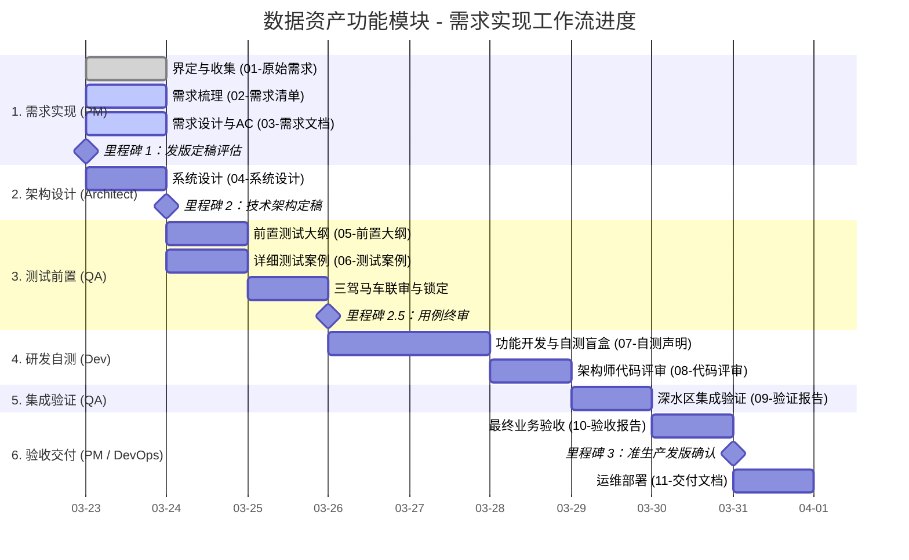

# 需求跟踪矩阵 (Requirement Tracking Matrix)

## 当前整体进度追踪

## 交付物节点状态追踪

| 阶段 | 交付物编号 | 交付物名称 | 负责人 | 状态 | 存储路径 |
| :--- | :--- | :--- | :--- | :--- | :--- |
| **PM 需求** | 01 | 原始需求与8H分析 | PM | 🟢 已完成 | `docs/01-原始需求.md` |
| **PM 需求** | 02 | 结构化需求清单 | PM | 🟡 进行中 | `docs/02-需求清单.md` |
| **PM 需求** | 03 | 详细需求规格与AC | PM | 🟡 进行中 | `docs/03-需求文档/` |
| **架构设计** | 04 | 系统架构与设计方案 | Architect | ⚪ 未开始 | `docs/04-系统设计/项目架构.md` |
| **测试设计** | 05 | 前置测试大纲 | QA | ⚪ 未开始 | `docs/05-前置测试大纲/` |
| **测试设计** | 06 | 详细测试案例 | QA | ⚪ 未开始 | `docs/06-详细测试案例/` |
| **研发阶段** | 07 | 开发者自测声明 | Frontend/Backend | ⚪ 未开始 | `docs/07-开发者自测声明/` |
| **代码评审** | 08 | 代码评审记录 | Architect | ⚪ 未开始 | `docs/08-代码评审记录/` |
| **集成验证** | 09 | 测试验证报告 | QA | ⚪ 未开始 | `docs/09-测试验证报告/` |
| **产品验收** | 10 | 产品最终验收报告 | PM | ⚪ 未开始 | `docs/10-产品验收报告/` |
| **运维交付** | 11 | 部署与用户手册 | DevOps | ⚪ 未开始 | `docs/11-交付文档/` |
