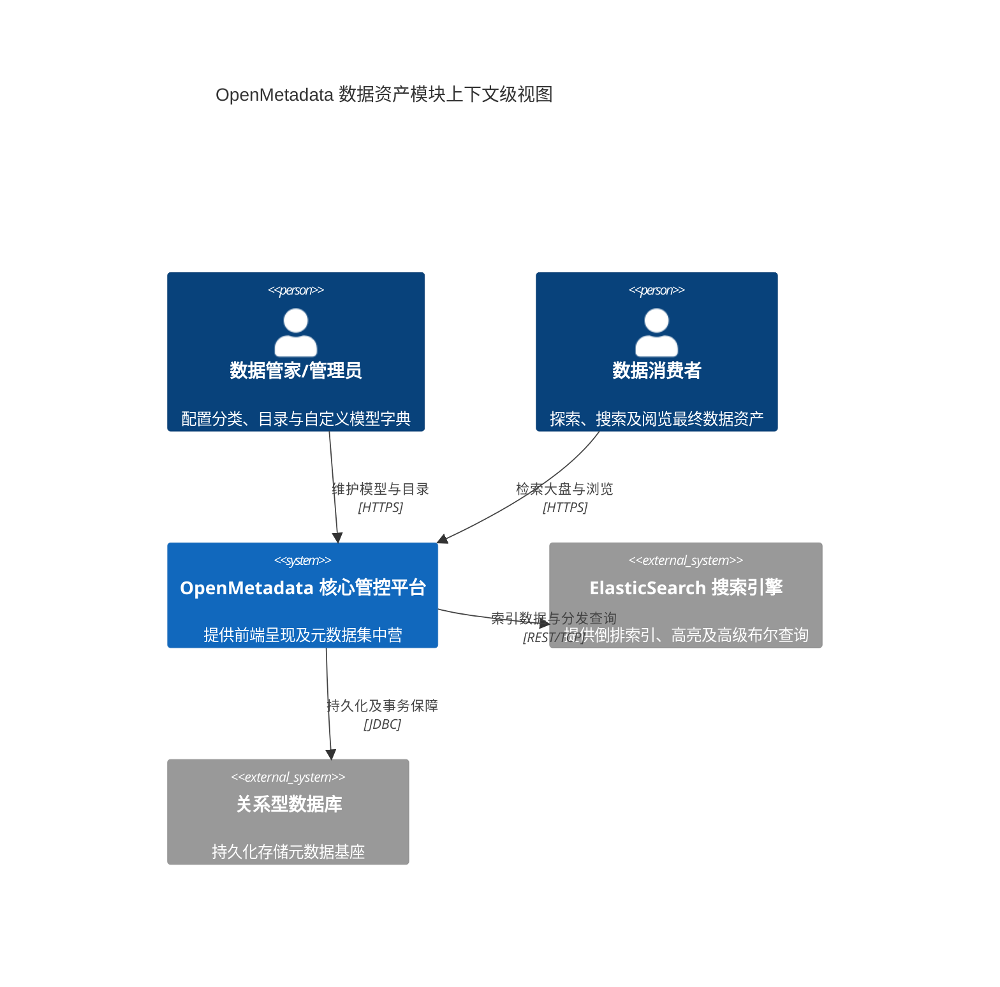
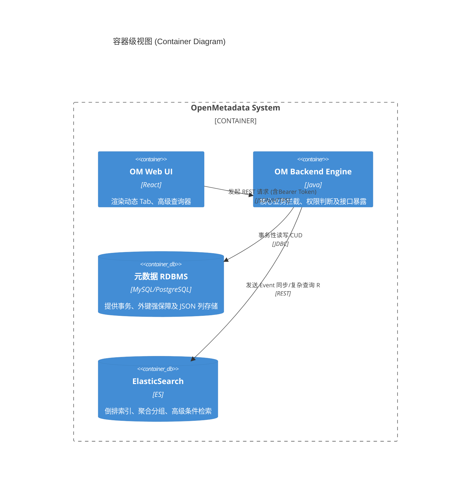
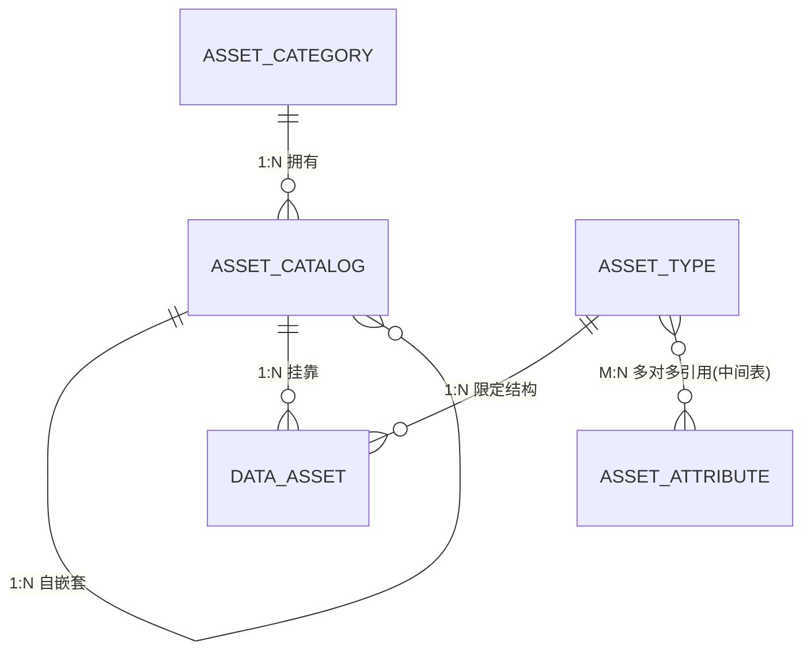

# 项目全局架构设计文档 (Project Architecture Document)

> **文档说明与最佳实践边界**
> 本文档是整个项目的**全局架构蓝图（Single Source of Truth）**，旨在收敛从各需求分散在各个切片中的架构知识。
> 结合 TOGAF 企业架构四域（业务、应用、技术、数据）理念与 C4 模型标准。

---

## 1. 系统概述 (System Overview)

### 1.1 业务背景与愿景
OpenMetadata (简称OM) 是一个开源的数据发现、数据质量和可观测性平台。本次新增的“数据资产”大模块，旨在补全OM在多级目录结构挂载及通过动态属性模板定义多样化数据资产（DataAsset）的核心业务短板，为企业提供中心化的数据资产地图门户。

### 1.2 系统边界与上下文 (System Context - C4 L1)

---

## 2. 架构决策记录池 (Architecture Decision Records - ADR)

| 编号 | 决策时间 | 架构决策上下文及其考量 (ADR) | 最终决定项 | 状态 |
|---|---|---|---|---|
| ADR-000 | 2026-03-23 | **背景**：确立系统原生底座技术栈。 **评估**：沿用OM原有生态；前端 React + Tailwind，后端 Java (Dropwizard/Spring) 方案。 **权衡**：保持技术栈纯粹，无缝利用 BaseEntity 与原版活动流通知拦截器。 | 采用 Java + React 原生体系 | 已采纳 |
| ADR-001 | 2026-03-23 | **背景**：扩展字段的高级检索支持引擎。 **评估**：由于 `DataAsset` 存在动态的 `extension` 扩展 JSON 结构，纯 DB 难以实现带 AND/OR 且高性能的关联查询。 **权衡**：强依赖 ElasticSearch 进行实体数据的打平映射。 | 依靠 ES 提供所有列表页查询能力 | 已采纳 |
| ADR-002 | 2026-03-23 | **背景**：无逻辑删除模式引发的外键灾难防范。 **评估**：需求明确要求强物理删除。 **权衡**：取消逻辑删除标记，在 DAO 层编纂 `@Transaction` 级联抹除逻辑，并在目录级加入 Pre-check 防止误毁数据资产。 | 物理软校验隔离+事务爆破 | 已采纳 |

---

## 3. 业务架构与领域划分 (Business Architecture)

### 3.1 核心业务流程 (Core Value Streams)
- **基石构筑流**：由上到下建设：分类(Category) -> 目录(Catalog)。
- **模型装配流**：由细到粗装配：属性(Attribute) -> 组装成 -> 类型(Type)。
- **资产投产流**：结合目录位置与类型特征，录入具体数据资产(DataAsset)，落入 ES。

### 3.2 限界上下文与领域模块 (Sub-Domains)
- **Asset Hierarchy Domain (资产层级域)**：专注于树形拓扑结构，管理资产分类与资产目录。
- **Asset Templating Domain (资产模板域)**：专注于动态表单与属性字典分发，管理类型与属性字典池。
- **Data Asset Domain (数据资产域)**：融合域。持有 `type_id` 与 `catalog_id` 构筑实体，并响应最终用户的 ES 搜索大盘。

---

## 4. 应用与技术架构 (Application & Technology Architecture)

### 4.1 容器架构视图 (Container Diagram - C4 L2)

### 4.2 技术栈总览
- **前端页面**：React 18 + UI Components (无缝继承 Explore 容器)
- **后端服务**：Java (搭载原生 OM DAO/Entity 驱动机制)
- **持久化存储**：MySQL 8.0+ / PostgreSQL 12+ (依赖 JSON 字段类型)
- **核心中间件**：ElasticSearch 8.x

---

## 5. 数据架构与模型流向 (Data Architecture)

### 5.1 全局核心实体关系图 (Core ER Diagram)

---

## 6. 核心非功能性规约

1. **接口规约**：强制 `/api/v1/asset/...` 命名空间。统一 `code/message/data`。
2. **鉴权体系**：修改 `DataAsset` 的扩展属性 JSON 时，后端必须进行 Role 鉴权拦截，核实发起者是否具备 `AssetAttribute` 规定的 `限定人员名单`。
3. **彻底绝后删除**：凡走 `DELETE` 方法的接口，不仅抹掉记录，需连带其在 ES 的对应文档及系统挂载的 Thread/Version 衍生记录一并由代码层消杀。

---

## 7. 架构演进与变更日志 (Changelog)

| 版本/需求编号 | 修订日期 | 架构变更说明 (What changed & Why) | 负责人 |
|---|---|---|---|
| 初始化 / ASSET-001~005 | 2026-03-23 | 确立数据资产五大核心模块实体架构。开辟 `asset` 独立包路径空间，正式引入了彻底物理删除范式及多对多属性组装设计。 | AI System Architect |
